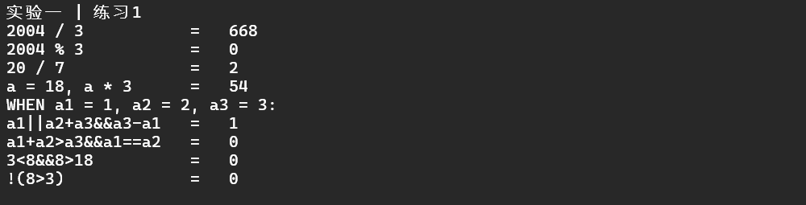
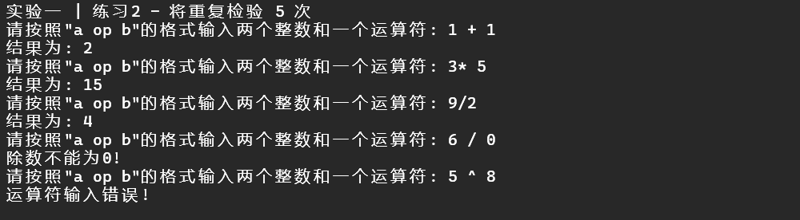
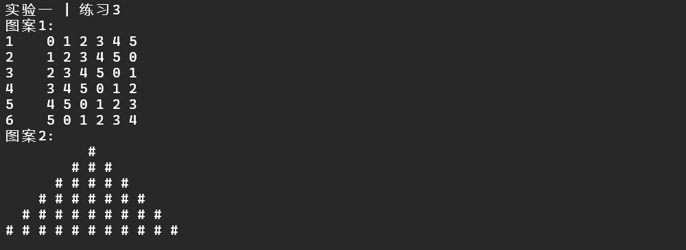
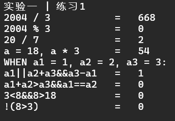
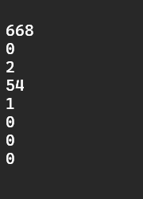

# 实验 1 - C++ 语言基础

> 智能 212 史胤隆 2006010529  
> 指导老师：杨伟杰

## 实验目的

1. 熟悉 Visual C++ 6.0 的开发环境与特点；
1. 熟悉 Visual C++ 6.0 开发环境下的源程序编辑、调试等功能；
1. 通过程序设计学习 C++ 程序设计基础知识.

## 实验内容及结果

### 练习 1

**通过程序求以下表达式的值并输出到屏幕上**

> 本例通过函数 `void opt_value()` 实现, 在 `main` 中调用.




### 练习 2

**定义一个计算器结构体，当输入两个整数及运算符后，可以进行算术四则运算**  
要求：被除数是 0 给出错误提示；运算符不是+、-、\*、/时给出错误提示

> 本例通过函数 `void comp_struct()` 实现.  
> 在 `main` 调用时，函数将被重复调用 `5` 次，以检验各种情况:
>
> ```cpp
> cout << endl
>      << "实验一 | 练习2 - 将重复检验 5 次" << endl;
>     for (int i = 0; i < 5; i++) {
>         comp_struct();
>     }
> ```



### 练习 3

**用循环语句编程打印矩阵和图案**




## 实验总结

### 1. 实际应用中的 "谭浩强" 式编程

练习 1 的第二部分，显然是温故了 C 语言的基本运算符优先级，同时也说明了在 C++ 中，运算符的优先级与 C 语言一致，放在这里也不算失当. 但是，在实际工程中，纠结优先级的问题是不太合适的；或者说，及时你能正确理解并使用复杂的运算优先级，也不应该在实际开发中如此操作：这将严重破坏代码的可读性.

当然，如果是基于 gcc 的编译器，编译器也会给出警告：

```cpp
实验一.cpp:19:57: warning: suggest parentheses around '&&' within '||' [-Wparentheses]
    cout << "a1||a2+a3&&a3-a1   =   " << (a1 || a2 + a3 && a3 - a1) << endl;
                                             ~~~~~~~~^~~~~~~~~~
```

所以，值得重视的是，我们在编程中，不但要考虑逻辑正确、性能良好，更要写出易读易懂、方便协助的代码，括号是必不可少的；**"谭浩强" 式炫技代码，不是好代码. **


### 2. 多题目任务的组织方式

在实验中，我们可以使用多个函数来组织不同的题目，这样可以使得代码更加清晰，也方便统一调试：

```cpp
void opt_value() { ... }
void comp_struct() { ... }
void printp() { ... }

int main()
{
    opt_value();
    for (int i = 0; i < 5; i++) comp_struct();
    printp();
    return 0;
}
```

同时，函数自带闭包属性，也保证了不同题目的变量不会相互污染，个人认为其在完成多个题目时的效率较反复注释或删除代码要高，也便于调试维护.


### 3. 合适的提示语

在编写程序时，我们不仅要保证程序的功能正确，还要保证程序的友好性. 以下两个输出，孰好孰坏，一目了然:

  

在练习 1 中，我们输出了多个运算结果，如果没有任何提示，我们很难一眼看出这些数字的意义；在练习 2 中，我们需要用户输入数字和运算符，如果没有提示，用户很难知道程序需要什么，甚至面对空空如也的控制台而根本不知道需要做输入.

所以，合适的提示语是非常重要的，它可以提高程序的友好性，也可以提高程序的可用性.
