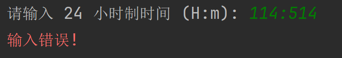

# 实验 2 - C++程序设计之函数篇

> 智能 212 史胤隆 2006010529  
> 指导老师：杨伟杰

## 实验目的

1. 熟悉 Visual C++6.0 的开发环境与特点。
1. 熟悉 Visual C++6.0 开发环境下的源程序编辑、调试等功能。
1. 通过程序设计学习 C++中函数的声明、定义、调用、重载
1. 学习 c++多文件结构

## 实验内容及结果

### 练习 1

**写一个程序将 24 小时制的时间转换为 12 小时制的时间**

  

  

### 练习 2

**编一个程序，用同一个函数名对圆、矩形、梯形求面积**

    

### 练习 3

**设计多文件工程用于求圆面积和矩形面积**

  

## 实验总结

### 1. 友好性、鲁棒性与输入检查

  

#### 知识点实践：条件编译

  
