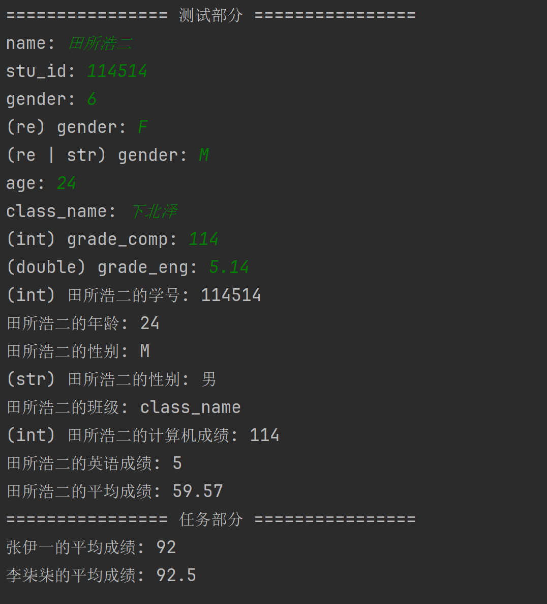

# 实验 2 - C++ 程序设计之函数篇

> 智能 212 史胤隆 2006010529  
> 指导老师：杨伟杰


## 一、实验目的

1. 熟悉 Visual C++6.0 开发环境下的源程序编辑、调试等功能。
1. 通过程序设计学习类与对象的声明、定义，成员的访问


## 二、实验内容及结果

**创建一个 Student 类，该类中具有学生姓名、学号、性别、年龄、班级、计算机成绩和英语成绩等属性。**
**创建该类的两个学生对象，并将他们的信息以及各自两门课的平均成绩进行输出。**

> 本例采用多文件结构; [详见源码](https://github.com/Vincy1230/OOP-class/blob/main/exp03/)

本练习考察对类及其成员函数的定义与使用。最终主程序效果如下：

- 可以在实例化时完全或不完全地初始化对象 (姓名和学号设计为不可忽略)

  ```cpp
  Student test("田所浩二", "0114514", 'M');
  ```

  ```cpp
  Student zhang_yy("张伊一", "2012101", 'F', 20, "信息121", 89, 95);
  ```

  

- 预定义操作数, 可以直接通过操作数填写函数参数

  ```cpp
  test.set(AGE /*0x4*/, 24);
  ```

  

- 可以通过 `.set()` `.get()` 成员函数对对象的单个属性进行修改和访问

  ```cpp
  test.set(/*key:*/ CLASS_NAME, /*value:*/ "下北泽");
  ```

  ```cpp
  const char* cn;
  test.get(/*key:*/ CLASS_NAME, /*value[&out]:*/ cn);
  ```

  

- 可以通过 `.name()` `.avg()` 两个成员函数快速获取姓名和平均成绩

  ```cpp
  std::cout << zhang_yy.name() << "的平均成绩: " << zhang_yy.avg() << std::endl;
  ```

  <div STYLE="page-break-after: always;"></div>

- **鲁棒性:** 兼容近似类型, 混用类型自动转换

  ```cpp
  test.set(GRADE_COMP, /*(int --> double)*/ 114);
  ```

  ```cpp
  int ge;
  test.get(GRADE_ENG, /*(int <-- double)*/ ge);
  ```

  

-   **可选鲁棒性:** 通过 define 开启或关闭对整型 id 的支持

    > 整型 id 是旧版软件常见的特征，即使如今仍有大量应用使用 (如腾讯 QQ)，但在现代软件设计中已经逐渐被淘汰，甚至可以称为是缺陷特征。**因此，对于整型 id 的兼容，我们采用可选的 define 方式，以表示其不是必要的特征。**

    ```cpp
    // student.h
    #define ALLOW_INT_ID
    
    ...
    
    // main
    int stu_id_int;
    test.get(STU_ID, stu_id_int);
    ```


#### 最终效果

<table>
<tr>
<th>初始化表达式</th>
<th>参数</th>
<th>含义</th>
<th>是否可选</th>
</tr>
<tr>
<td rowspan="7"> Student(<br/>&emsp;&emsp;std::string name,<br/>&emsp;&emsp;std::string stu_id,<br/>&emsp;&emsp;char gender = '\0',<br/>&emsp;&emsp;int age = -1,<br/>&emsp;&emsp;std::string class_name = "",<br/>&emsp;&emsp;double grade_comp = -1,<br/>&emsp;&emsp;double grade_eng = -1<br/>);</td>
<td> name [std::string] </td>
<td> 学生姓名 </td>
<td> 否 </td>
</tr>
<tr>
<td> stu_id [std::string] </td>
<td> 学号 </td>
<td> 否 </td>
</tr>
<tr>
<td> gender [char] </td>
<td> 性别 </td>
<td> 是 </td>
</tr>
<tr>
<td> age [int] </td>
<td> 年龄 </td>
<td> 是 </td>
</tr>
<tr>
<td> class_name [std::string] </td>
<td> 班级 </td>
<td> 是 </td>
</tr>
<tr>
<td> grade_comp [double] </td>
<td> 计算机成绩 </td>
<td> 是 </td>
</tr>
<tr>
<td> grade_eng [double] </td>
<td> 英语成绩 </td>
<td> 是 </td>
</tr>
</table>
<div STYLE="page-break-after: always;"></div>


<table style="text-align:center">
<tr>
<th> 方法 </th>
<th> 键 </th>
<th> 含义 </th>
<th> 原始类型 </th>
<th> 兼容类型 </th>
<th> 返回值 </th>
</tr>
<tr>
<td rowspan="7" style="text-align:left"> set(<br/>int key,<br/>[T] value<br/>);<br/>get(<br/>int key,<br/>[T] & value<br/>); </td>
<td> NAME </td>
<td> 学生姓名 </td>
<td> std::string [&] </td>
<td> - </td>
<td rowspan="7"> NULL </td>
</tr>
<tr>
<td> STU_ID </td>
<td> 学号 </td>
<td> std::string [&] </td>
<td> int [&] (*注) </td>
</tr>
<tr>
<td> GENDER </td>
<td> 性别 </td>
<td> char [&] </td>
<td> std::string [&] </td>
</tr>
<tr>
<td> AGE </td>
<td> 年龄 </td>
<td> int [&] </td>
<td> double [&] </td>
</tr>
<tr>
<td> CLASS_NAME </td>
<td> 班级 </td>
<td> std::string [&] </td>
<td> - </td>
</tr>
<tr>
<td> GRADE_COMP </td>
<td> 计算机成绩 </td>
<td> double [&] </td>
<td> int [&] </td>
</tr>
<tr>
<td> GRADE_ENG </td>
<td> 英语成绩 </td>
<td> double [&] </td>
<td> int [&] </td>
</tr>
<tr>
<td> name(); </td>
<td colspan="4"> - </td>
<td> std::string name </td>
</tr>
<tr>
<td> avg(); </td>
<td colspan="4"> - </td>
<td> double avg </td>
</table>
> *注：仅当 `#define ALLOW_INT_ID` 生效时有效


  
