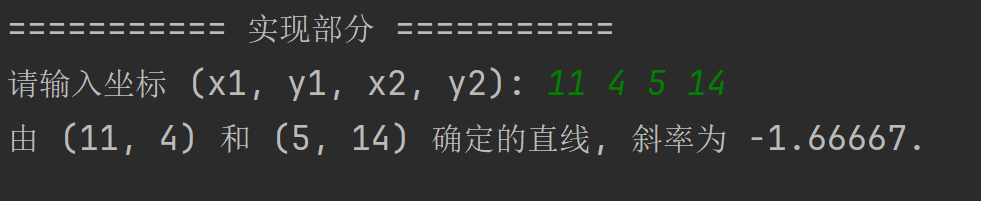
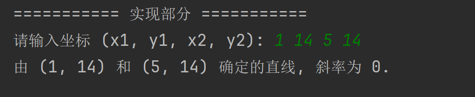
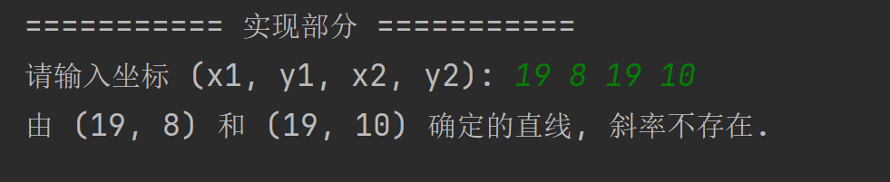
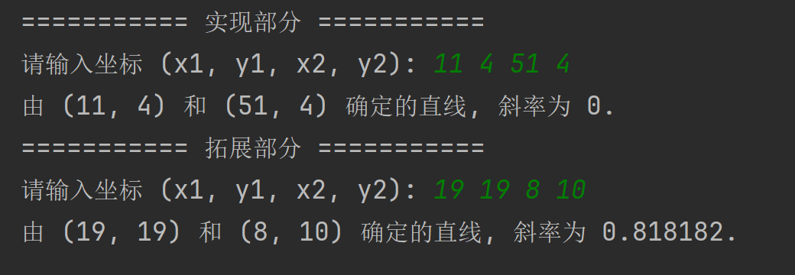

# 实验 4 - C++ 程序设计之类与对象篇

> 智能 212 史胤隆 2006010529  
> 指导老师：杨伟杰


## 一、实验目的

1. 熟悉 Visual C++6.0 开发环境下的源程序编辑、调试等功能。
1. 通过程序设计学习类与对象的声明、定义，成员的访问
1. 练习构造函数的使用


## 二、实验内容及结果

**设计一个 Line 类，用于表示二维坐标系中任意一条直线，并输出该直线的属性。**
**包含一个 Point 类，该类中有两个私有数据成员 x、y，有三个公有的成员函数，分别用于返回 x、y 的值，以及显示 x、y 的值；包含一个 Line 类，具有三个 Point 类型的私有数据成员 point1、point2 和斜率 K，有一个公有成员函数，用于输出 Line 的端点坐标、斜率等属性。**

> 本报告仅包含练习 2，练习 1 为上期实验内容，[详见此处](https://github.com/Vincy1230/OOP-class/tree/main/exp03)


本练习继续考察对类及其成员函数的定义与使用，同时涉及对象的复制和初始化。  
实验的基本实现条件是：

- 可以初始化或不初始化地创建对象

  ```cpp
  Point p1(x1, y1);
  Line l(p1, p2);
  ```

  ```cpp
  Line expand_l;
  ```

  

-   经初始化的对象具有打印能力

    ```cpp
    p1.print();
    ```

    ```cpp
    l.print();
    ```

<div STYLE="page-break-after: always;"></div>

#### 最终效果

|  类型  |                         效果                          |
| :----: | :---------------------------------------------------: |
| 常规线 |  |
| 水平线 |  |
| 垂直线 |  |


#### 实现原理解析

我们在 main 函数中并没有直接使用 Point 对象输出方法 `Point::print()`。这是因为在 Line 类中定义的 `Line::print()` 函数的坐标文本正是通过调用 `Point::print()` 函数实现的。

```cpp
void Line::print() const
{
    std::cout << "由 ";
    _p1.print();
    std::cout << " 和 ";
    _p2.print();
    std::cout << " 确定的直线, 斜率";
    if (_k == DBL_MAX)
        std::cout << "不存在.";
    else
        std::cout << "为 " << _k << ".";
}
```

`Line::print()` 函数就是对 `Point::print()` 函数的封装和复用。

<div STYLE="page-break-after: always;"></div>

## 三、知识拓展

在实验中对运算符重载进行了额外的拓展。通过对 `>>` 和 `<<` 运算符的重载，我们可以将 Point 和 Line 对象直接加入 io 流中输入和输出。程序最终表现不变，但代码的简洁性和直观性得到了大幅提升。

```cpp
std::cout << "=========== 实现部分 ===========" << std::endl;
int x1, y1, x2, y2;
std::cout << "请输入坐标 (x1, y1, x2, y2): ";
std::cin >> x1 >> y1 >> x2 >> y2;
Point p1(x1, y1);
Point p2(x2, y2);
Line l(p1, p2);
l.print();
std::cout << std::endl;
```

```cpp
std::cout << "=========== 拓展部分 ===========" << std::endl;
Line expand_l;
std::cout << "请输入坐标 (x1, y1, x2, y2): ";
std::cin >> expand_l;
std::cout << expand_l << std::endl;
```


#### 启用拓展内容

通过激活 `#define EXPAND` 宏，可以启用拓展部分的代码：

  
